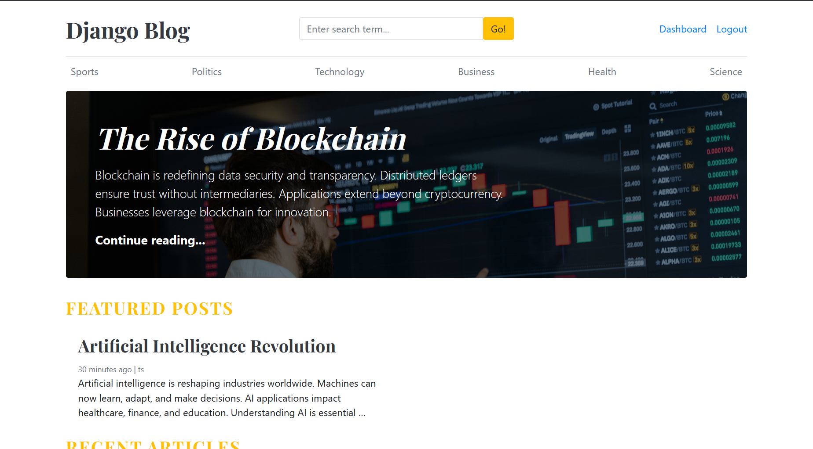
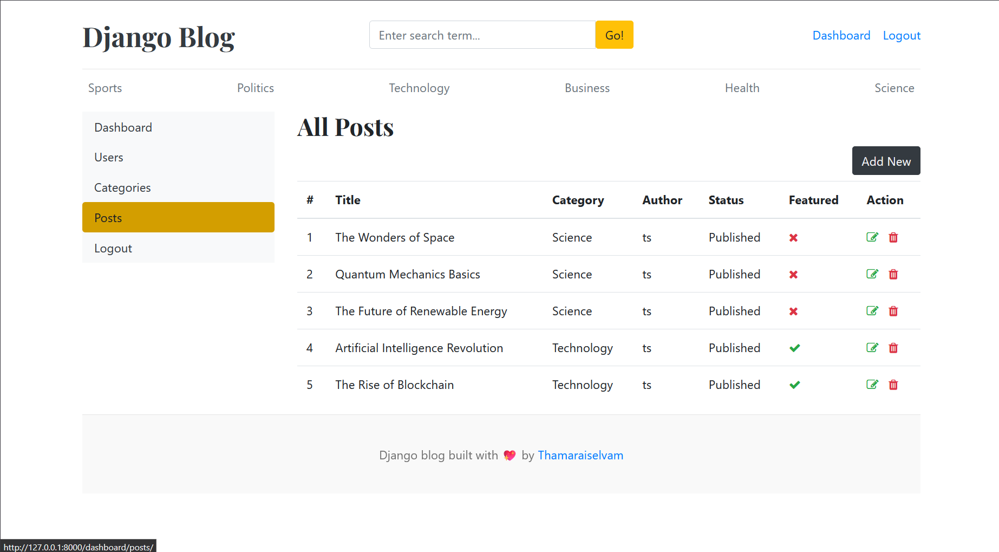
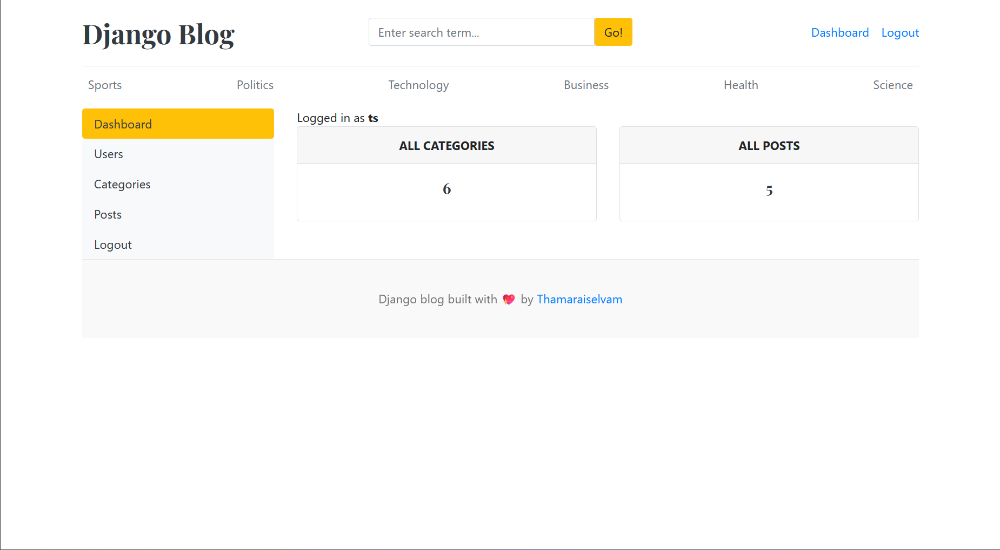
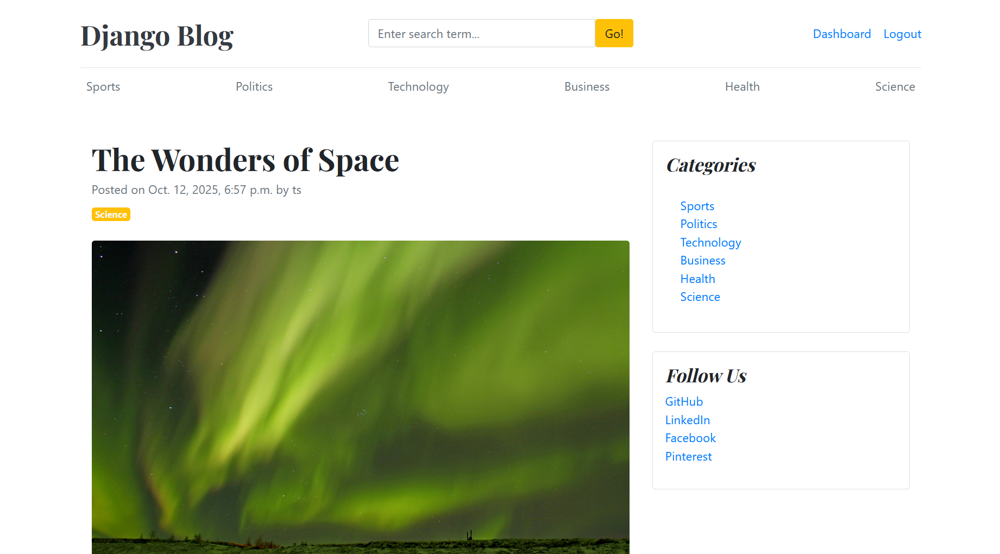

# Django Blog Project

[](https://www.python.org/) 
[](https://www.djangoproject.com/) 
[](LICENSE)

A full-featured **Django blogging platform** with categories, blog posts, comments, and user management. The project allows creating featured posts, uploading images, and managing blog content via an admin dashboard.

---

## 🌟 Features

- User authentication (superuser & regular users)  
- CRUD operations for **categories** and **blog posts**  
- Blog posts with title, slug, featured image, short description, body, status (draft/published), and “is featured” flag  
- Comment system for each blog post  
- Responsive templates and modern design  
- Admin dashboard for easy management of content  

---

## 🖼 Screenshots

**Homepage**  

**Admin Dashboard**  



**Blog Post Page**  


---

## 📂 Project Structure

```

django-blog-project/
├── blogs/                 # Blog app: models, views, templates
├── dashboards/            # Admin dashboard app
├── blog_main/             # Main project settings
├── media/                 # Uploaded images
│   └── uploads/
├── templates/             # Global HTML templates
├── manage.py
├── requirements.txt
└── db.sqlite3

````

---

## ⚙️ Installation & Setup

1. **Clone the repository**
```bash
git clone https://github.com/dev-rathankumar/django-blog-project.git
cd django-blog-project
````

2. **Create a virtual environment**

```bash
python -m venv venv
# Windows
venv\Scripts\activate
# macOS/Linux
source venv/bin/activate
```

3. **Install dependencies**

```bash
pip install -r requirements.txt
```

4. **Apply migrations**

```bash
python manage.py makemigrations
python manage.py migrate
```

5. **Create a superuser**

```bash
python manage.py createsuperuser
```

6. **Run the development server**

```bash
python manage.py runserver
```

7. **Access the app**

* Frontend: [http://127.0.0.1:8000/](http://127.0.0.1:8000/)
* Admin dashboard: [http://127.0.0.1:8000/admin/](http://127.0.0.1:8000/admin/)

---

## 🧭 Models Overview

**Category**

* `category_name`: Unique name
* `created_at` & `updated_at`: Timestamp

**Blog**

* `title`, `slug`, `category`, `author`
* `featured_image` (upload)
* `short_description` (4–5 lines), `blog_body` (detailed content)
* `status` (Draft/Published)
* `is_featured` (Boolean)
* `created_at` & `updated_at`

**Comment**

* `user` (ForeignKey)
* `blog` (ForeignKey)
* `comment` (text)
* `created_at` & `updated_at`

---

## 🔒 Notes & Best Practices

* In production, use PostgreSQL or MySQL instead of SQLite.
* Serve media files correctly via cloud storage or web server configuration.
* Keep your `SECRET_KEY` secure and set `DEBUG=False`.
* Ensure proper handling when deleting users (e.g., reassign authorship of blogs).

---

## 📦 Dependencies

Check `requirements.txt` for all packages.

* Django 4.2
* Pillow 9.5.0
* django-crispy-forms 2.0
* crispy-bootstrap4 2022.1

---

## 📝 License

MIT License – see the [LICENSE](LICENSE) file for details.

---

## 🚀 Contribution

Contributions are welcome!

1. Fork the repository
2. Create a branch (`git checkout -b feature-name`)
3. Commit your changes (`git commit -m "Add feature"`)
4. Push to branch (`git push origin feature-name`)
5. Open a pull request

---

```

If you want, I can **also create a ready-to-use “Live Demo & Features” section with placeholders for screenshots, links, and GIFs** so your README looks like a professional project page on GitHub.  

Do you want me to do that next?
```
